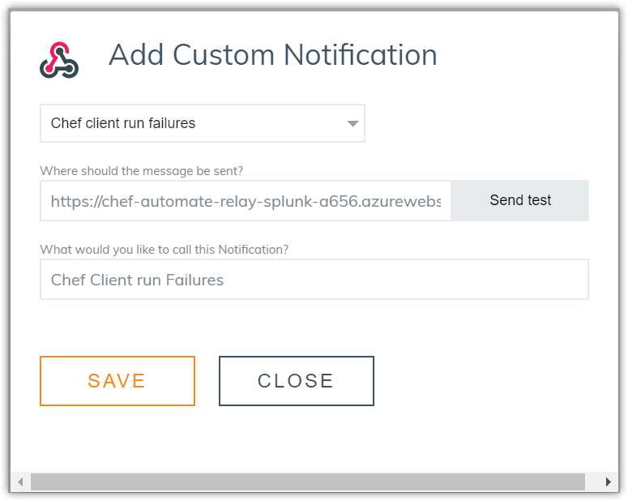

# Splunk relay for Chef Automate

[](https://portal.azure.com/#create/Microsoft.Template/uri/https%3A%2F%2Fraw.githubusercontent.com%2Fchef-partners%2Fsplunk-relay%2Fmaster%2Fazuredeploy.json)

Use this Chef Automate Splunk integration to channel notification messages such as:

 - Chef Client run failures
 - Compliance failures

into Splunk.

You will need a Splunk account that has been configured with an [HTTP Event Collector input](http://docs.splunk.com/Documentation/SplunkCloud/6.6.1/Data/UsetheHTTPEventCollector). From Splunk you will need the customer id and the token in order to post data.

## Parameters

The template contains a number of parameters that customise the way in which the function is deployed and runs. The following table describes these parameters.

| Name | Description | Default Value |
|------|-------------|---------------|
| functionsAppName | Name of the Function App within the resource group | chef-automate-relay-splunk |
| functionsStorageAccountType | Storage type for the storage account in which the function will be stored | Standard_LRS |
| splunkCustomerId | Customer ID within the Splunk platform | |
| splunkToken | API Token that has been set on the HTTP Endpoint Collector (HEC) | |
| splunkChannel | UUID string to designate a channel within Splunk | |
| splunkPort | Port on which to communciate with the HEC | 8088 |
| splunkNoSslVerify | Do not verify the Splunk HEC certificate | 0 |

The `splunkChannel` and `splunkNoSslVerify` are specified on the URL for the Azure Function when called. The format is as follows

```https://<APP_NAME>.azurewebsites.net/api/<CHANNEL>/<LOG_TYPE>/<SSL_VERIFY>?code=xxxxxx```

The log type is intended to be one of the following options and allows Chef client and Cmpliance information to be tagged accordingly:

 - ChefClientRunFailure
 - ComplianceFailure

The `xxxxxx` for the code is the token that is required when using the Azure Function. This is retrievebale from the function itself or the outputs of the ARM template.


## How to deploy the template

### Azure Portal

Simply press the [Deploy to Azure](https://portal.azure.com/#create/Microsoft.Template/uri/https%3A%2F%2Fraw.githubusercontent.com%2Fchef-partners%2Fsplunk-relay%2Fmaster%2Fazuredeploy.json) button to launch the template within your Azure Subscription. You are required to complete the form:


When the deployment has completed go to the Resource Group and click the item below 'Deployments'. (It should state '1 Succeeded'). Then click on the 'Microsoft.Template' to show the outputs:


These outputs are required when configuring Chef Automate.

### Command Line

Alternatively the relay can be deployed from the command line using the Azure CLI or Powershell.

Clone the repo to the local machine.
#### Azure CLI

```bash
az group create -n "splunk-relay-example" -l "westeurope"
az group deployment create -g "splunk-relay-example" --template-file azuredeploy.json --parameters @parameters.json --no-wait
```

The outputs from the template can be see when the deployment is interrogated.

```bash
az group deployment list -g "splunk-relay-example"
```

NOTE: The outputs will not be displayed until the deployment is complete and successful.

Any deployments from the command line are also shown in the Azure Portal.

#### PowerShell

```powershell
New-AzureRmResourceGroup -Name "splunk-relay-example" -Location "westeurope"
New-AzureRmResourceGroupDeployment -Name "ExampleSplunkRelayDeployment" -ResourceGroupName "splunk-relay-example" -TemplateFile .\azuredeploy.json -TemplateParameterFile .\parameters.json
```

## Configure Automate

Once the output information has been retrieved configure Chef Automate by adding a new Custom Notification in the Notifications tab.




Thats it! Now after some of the nodes have checked in you should be able to see data in the Splunk instance.


## Compatibility

You will need Chef Automate 1.6.99 or above to use this integration.

If you do not see 'Notifications' on the side bar, enable the functionality in Chef Automate visit the 'Nodes' tab, click on any white space on the page an type **BETA**. A new notifications side menu will appear.

## Licensing

This integration is provided free of charge to customers of Chef Automate. Charges may apply for usage of Splunk.

(c) 2017 Chef Software, Inc.
